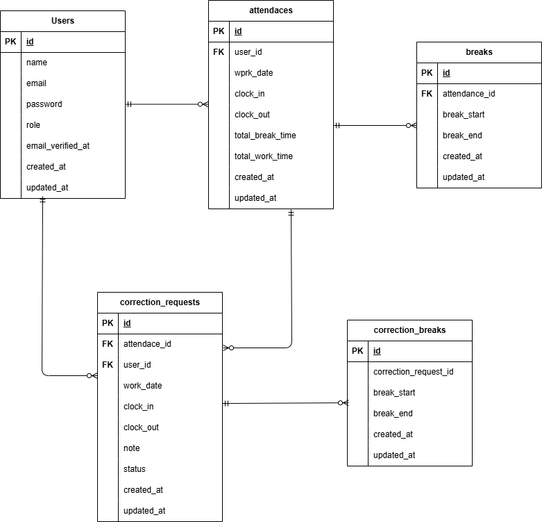

# 勤怠管理アプリ

## 環境構築

### Docker ビルド

1. Dockerを起動する
2. `git clone git@github.com:seki0603/attendance-management.git`
3. cd attendance-management
4. mkdir docker/mysql/data
5. docker-compose up -d --build

* MySQL は、OS によって起動しない場合があるのでそれぞれの PC に合わせて docker-compose.yml ファイルを編集してください。
<br>

### Laravel 環境構築

1. docker-compose exec php bash
2. composer install
3. cp .env.example .env
4. php artisan key:generate
5. php artisan migrate --seed

* .env.exampleの値はダミー値です。そのまま利用可能ですが、必要に応じて.envで設定し直してください。
   <br>

## メール認証機能について

MailHog にて実装しています。  
.env.exampleにて必要項目を設定しているため、Docker起動後はhttp://localhost:8025 にて受信確認可能です。
<br>

## 動作確認について
ダミーデータにて、管理者ユーザー1名・一般ユーザー5名が作成されます。  
一般ユーザーには過去2か月分の勤怠情報と、承認待ち・承認済みの修正申請がそれぞれ3件ずつ付随して作成されます。  
ログイン情報は以下の通りです。
```
管理者ユーザー
Email: admin@example.com
Password: password123

一般ユーザー
Email: test{$index}@example.com
Password: password123
※{$index}には1 ~ 5の数字が入ります。
```
<br>

* 管理者ユーザーログインフォーム: http://localhost/admin/login
* 一般ユーザーログインフォーム: http://localhost/login
<br>

## 使用技術

- PHP 8.1.33
- Laravel 8.83.29
- MySQL 8.0.26
- nginx 1.21.1
  <br>

## テスト実行方法

プロジェクトディレクトリ直下で実行してください。

1. docker-compose exec mysql bash
2. mysql -u root -p
3. パスワードはrootと入力
4. CREATE DATABASE laravel_test;
5. MySQL コンテナから抜ける
6. docker-compose exec php bash
7. vendor/bin/phpunit
   <br>

## ER 図



## 補足事項

案件シートの画面遷移にて、認証誘導画面 → 認証画面と指定がありましたが、  
認証画面の Figma 参考 UI が無かったため、デザインは自作しています。  
認証誘導画面から認証画面への遷移自体は可能ですが、  
認証誘導画面時点でメールの認証を完了した場合、自動的にプロフィール設定画面に遷移します。

## URL

- phpMyAdmin：http://localhost:8080/
- MailHog : http://localhost:8025/
- 案件シート : https://docs.google.com/spreadsheets/d/1JlNd_83k-46O3mA-Htkidf4ZK5s2_a6X9uONkiP3kPY/edit?gid=950806051#gid=950806051
